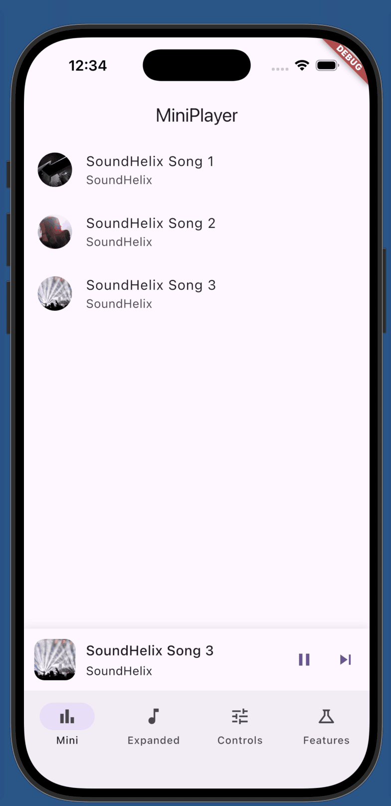
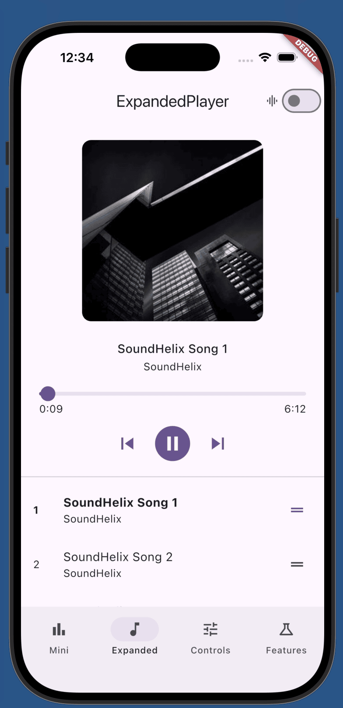
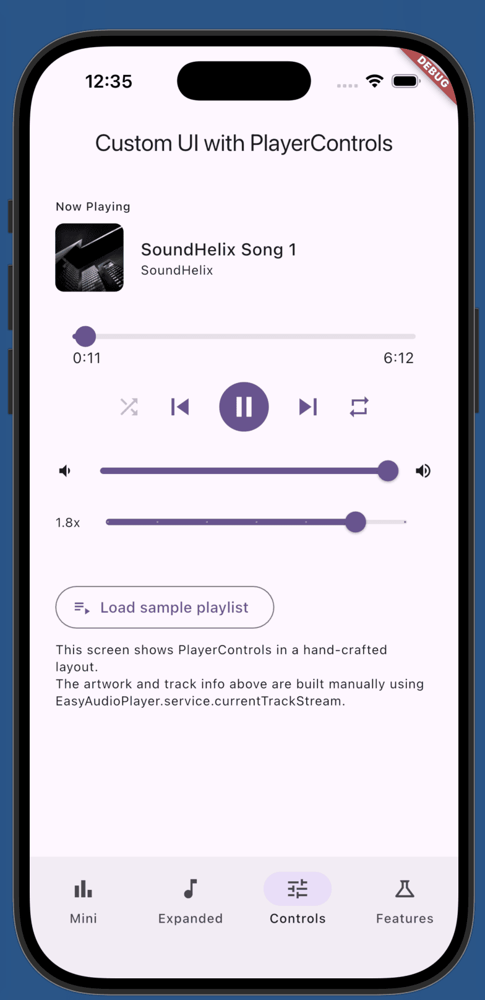
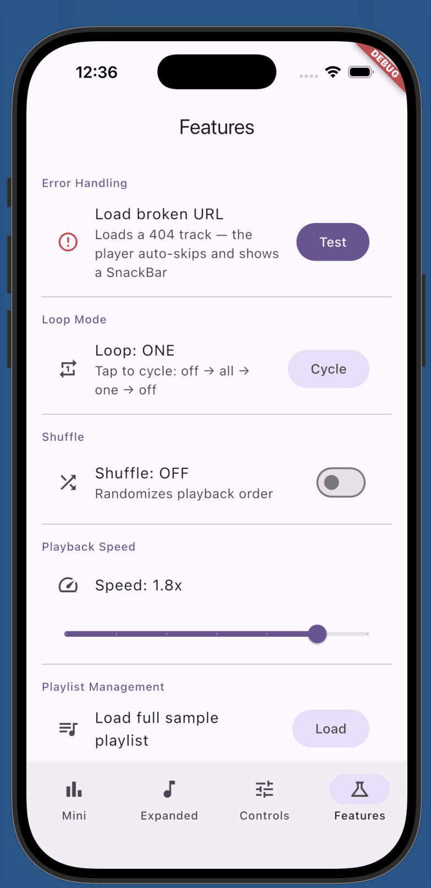

# easy_audio_player

A Flutter audio player package that combines polished Material 3 UI, background playback with lock-screen notifications, and a simple one-line setup.


---

## Screenshots

<table>
  <tr>
    <td align="center"><br/><sub><b>MiniPlayer</b></sub></td>
    <td align="center"><br/><sub><b>ExpandedPlayer</b></sub></td>
    <td align="center"><br/><sub><b>PlayerControls</b></sub></td>
    <td align="center"><br/><sub><b>Features</b></sub></td>
  </tr>
</table>

## Features
- **Three ready-made widgets** — `MiniPlayer`, `ExpandedPlayer`, `PlayerControls`
- **Background playback** — lock-screen controls and notification via `just_audio_background`
- **Playlist management** — load, add, remove, reorder, shuffle, loop
- **Material 3 adaptive theming** — reads your app's `ColorScheme` by default
- **Waveform visualization** — Android, iOS, macOS (opt-in via `showWaveform`)
- **Headless mode** — drive the service directly via `EasyAudioPlayer.service` for custom UIs

---

## Installation

```yaml
dependencies:
  easy_audio_player: ^1.0.0
```

---

## Platform setup

### Android

In `android/app/src/main/AndroidManifest.xml`:

```xml
<!-- Permissions (inside <manifest>) -->
<uses-permission android:name="android.permission.WAKE_LOCK"/>
<uses-permission android:name="android.permission.FOREGROUND_SERVICE"/>
<uses-permission android:name="android.permission.FOREGROUND_SERVICE_MEDIA_PLAYBACK"/>

<!-- Replace MainActivity with AudioServiceActivity (inside <application>) -->
<activity android:name="com.ryanheise.audioservice.AudioServiceActivity" ...>

<!-- Background service + media button receiver (inside <application>) -->
<service
  android:name="com.ryanheise.audioservice.AudioService"
  android:foregroundServiceType="mediaPlayback"
  android:exported="true">
  <intent-filter>
    <action android:name="android.media.browse.MediaBrowserService"/>
  </intent-filter>
</service>

<receiver
  android:name="com.ryanheise.audioservice.MediaButtonReceiver"
  android:exported="true">
  <intent-filter>
    <action android:name="android.intent.action.MEDIA_BUTTON"/>
  </intent-filter>
</receiver>
```

In `android/app/build.gradle`, set `minSdkVersion 21`.

### iOS

In `ios/Runner/Info.plist`:

```xml
<key>UIBackgroundModes</key>
<array>
  <string>audio</string>
</array>
```

---

## Quick start

### 1. Initialize in `main()`

```dart
void main() async {
  WidgetsFlutterBinding.ensureInitialized();

  await EasyAudioPlayer.init(
    config: const AudioPlayerConfig(
      androidNotificationChannelId: 'com.myapp.audio',
      androidNotificationChannelName: 'My App Audio',
    ),
  );

  runApp(const MyApp());
}
```

### 2. Load tracks and drop in a widget

```dart
// Load a playlist
await EasyAudioPlayer.service.load([
  AudioTrack.network(
    id: 'track_1',
    url: 'https://example.com/song.mp3',
    title: 'My Song',
    artist: 'Artist',
    artworkUrl: 'https://example.com/art.jpg',
  ),
]);
await EasyAudioPlayer.service.play();

// Pin a mini player at the bottom
Scaffold(
  body: Column(
    children: [
      Expanded(child: MyContent()),
      const MiniPlayer(),
    ],
  ),
)
```

---

## Widgets

### MiniPlayer

A compact 72 px player — artwork, title/artist, play/pause, and skip next.

```dart
MiniPlayer(
  onTap: () => navigateToFullPlayer(),
)
```

### ExpandedPlayer

Full-screen player with artwork, metadata, seek bar, controls, optional waveform, and optional playlist.

```dart
ExpandedPlayer(
  showWaveform: true,   // Android, iOS, macOS only — silently ignored elsewhere
  showPlaylist: true,
)
```

> **Note:** When `showPlaylist: true`, `ExpandedPlayer` uses an `Expanded` widget internally and must be placed inside a parent with bounded height (e.g., a `Scaffold` body). Set `showPlaylist: false` for unbounded contexts.

### PlayerControls

Headless controls widget — no artwork, no layout opinions. Use this to build your own player UI.

```dart
PlayerControls(
  showSeekBar: true,
  showShuffle: true,
  showLoop: true,
  showVolume: true,
  showSpeed: true,
)
```

---

## AudioTrack

```dart
// Network stream
AudioTrack.network(
  id: 'unique_id',
  url: 'https://example.com/track.mp3',
  title: 'Track Title',
  artist: 'Artist',         // optional
  album: 'Album',           // optional
  artworkUrl: 'https://…',  // optional, shown in notification
  duration: Duration(minutes: 3, seconds: 30), // optional
  extras: {'genre': 'Pop'}, // optional, passed to MediaItem
)

// Local file
AudioTrack.file(
  id: 'local_1',
  file: File('/path/to/track.mp3'),
  title: 'Local Track',
)
```

---

## Service API

All streams are `BehaviorSubject`-backed — they replay the latest value immediately on subscription.

```dart
final service = EasyAudioPlayer.service;

// Playback controls
await service.load(tracks, initialIndex: 0);
await service.play();
await service.pause();
await service.seek(Duration(seconds: 30));
await service.skipToNext();
await service.skipToPrevious();

// Queue management
await service.add(track);
await service.insert(0, track);
await service.remove(index);
await service.move(from, to);
await service.clear();

// Settings
await service.setVolume(0.8);      // 0.0–1.0
await service.setSpeed(1.5);       // 0.5–2.0
await service.setLoopMode(EasyLoopMode.all); // off | one | all
await service.setShuffle(true);

// Streams
service.playerStateStream   // Stream<EasyPlayerState>
service.currentTrackStream  // Stream<AudioTrack?>
service.positionStream      // Stream<Duration>
service.durationStream      // Stream<Duration?>
service.queueStream         // Stream<List<AudioTrack>>
service.errorStream         // Stream<AudioPlayerError>

// Sync getters (latest value, no await needed)
service.playerState
service.currentTrack
service.position
service.queue
```

### Player states

```dart
switch (service.playerState) {
  PlayerIdle()       => // nothing loaded
  PlayerBuffering()  => // loading
  PlayerPlaying(pos) => // playing at pos
  PlayerPaused(pos)  => // paused at pos
  PlayerCompleted()  => // reached end
  PlayerError(err)   => // failed — auto-skips to next track
}
```

### Error handling

On track failure the player auto-skips to the next track and emits on `errorStream`:

```dart
EasyAudioPlayer.service.errorStream.listen((error) {
  print('${error.trackId} failed: ${error.message} (${error.category})');
});
```

---

## Theming

Widgets inherit your app's Material 3 `ColorScheme` and `TextTheme` by default. Pass an `AudioPlayerTheme` to override:

```dart
MiniPlayer(
  theme: AudioPlayerTheme(
    primaryColor: Colors.deepPurple,
    backgroundColor: Colors.black,
  ),
)
```

---

## Teardown

```dart
await EasyAudioPlayer.dispose();
```
